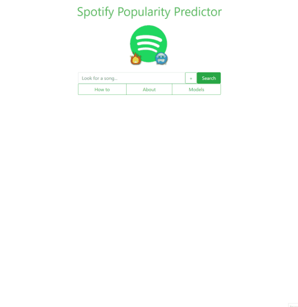

<h1 align="center">🎧 
  Spotify Popularity Predictor
</h1>
<h3 align="center">Predict song popularity using Machine Learning</h3>

 

<h3 align="center"><a href="https://predict.reshra.xyz/" target="_blank">Live preview</a></h3>

## 💬 About

This is a tool that uses machine learning to predict whether a song has the features that popular songs today have. In other words, it tries to predict whether a song has the potential to be popular.

The models available are trained on a dataset of 570 songs from Spotify from a lot of different charts in different regions around the globe. Out of these songs, we clasify as popular the songs that have 90 or more popularity(a metric from Spotify).

The model outputs takes as input the song you search for and outputs a label. There are two possible labels: 0 or 1 i.e. not popular or popular.

This app was part of [my disertation](https://github.com/pawKer/3rd_year_report/blob/master/compiled_pdf/RaresDinuDissertationFinal14.pdf) and the Jupyter Notebooks used for the research can be found [here](https://github.com/pawKer/Predicting-music-popularity).

[More info](#-more-information)

## ❓ How it works

Just search for a song as you would on the Spotify app. You will get the first result that matches your query and an emoji depicting the label predicted by the classifier.

Fire emoji Fire emoji means the song was predicted popular and the cold face emoji Cold face emoji means the song was predicted not popular.

Popular does not mean the song is popular right now, instead it means that the song has the features of a popular song.

## 💻 Models

If you click the '+' next to the input field you get a selection of models you can choose from. You can switch between them to compare results. The testing is done with 10-fold cross-validation. The models available and their scores are given below:

- MLP with SMOTE - 0.692
- SVM - 0.772
- SVM with SMOTE - 0.769
- Log. Reg. - 0.744
- MLP Online with SMOTE - 0.684 (gets better with each prediction)

The scoring used is **Area Under the Receiver Operator Curve**. A very good model will have a score close to 1 and a random guesser will have a score closer to 0.5.

## 💬 More information

To output this label, when it is trained, our model looks at the features of a song (13 in total) such as tempo, duration, loudness, key, mode, etc. and tries to find a correlation between the values of the features and the popularity of the song. The popularity is a metric derived by spotify and it is calculated depending on the number of plays a song gets and how recent those plays are.

After it has done the learning it has established certain rules to apply to a new song. For example, it might have established that all songs with a tempo over 100bpm are popular. So, if you would search for a song that meets that criteria it will be predicted as popular. The actual rules depend on all the input features and may be really complex.

Given the fact that the features our model uses are only dependent on the raw audio, it means that the predicted label represents whether a song has the features a popular songs has. In other words, our model finds patterns in popular songs and tells us whether the song we look for has those patterns. We can then infer that a song predicted as popular has the potential of actually becoming popular. Of course, the popularity of a song depends on much more than the features of the raw audio(it can depend on the artist, whether the song appears in a popular film, if it is being played a lot on the radio) so it doesn't mean that the results of this tool will directly apply to the real world but it can provide an indication.

## ⚙ Tech

- Python
- Flask
- Bootstrap
- Spotify API
- Docker

## 📦 Deployment

~~Deployed as a container on Heroku. The commands to do that are in `Dockerfile`.~~ Moved to self hosted solution.
